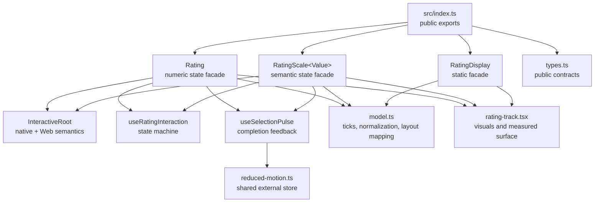
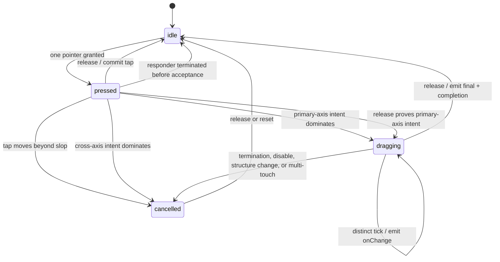

# Version 4 architecture and integrated release plan

Status date: **2026-07-28**

## Release contract

The next version ships as one integrated pull request and one release. There are no intermediate packages, temporary feature flags, parallel gesture engines, or compatibility components to remove later.

The release is complete only when all of these move together:

- numeric rating correctness;
- tap/drag/keyboard/accessibility interaction;
- exact static display;
- semantic scales;
- custom rendering;
- RTL and vertical layout;
- reduced-motion animation and list performance;
- examples, migration guidance, package compatibility, and release evidence.

“Latest” means the latest validated combination, not blindly accepting every new dependency. A dependency update that prevents the main check or React Native matrix from running is not release-ready.

## Architectural decisions

### Compose three jobs instead of one mode-heavy component

The public API has three focused components:

| Component | Job | Empty value | Interaction allocation |
| --- | --- | --- | --- |
| `Rating` | Select a numeric aggregate across repeated visual items | `0` | Only when not `readOnly` |
| `RatingDisplay` | Render an exact read-only aggregate | `0` | None |
| `RatingScale<Value>` | Select an ordered semantic choice such as NPS/Likert/emoji | `null` | Only when not `readOnly` |

This prevents incompatible semantics from accumulating as boolean props on one component. In particular, a star rating can safely reserve zero for “unrated,” while NPS and bipolar scales must preserve zero and negative values.

### One root interaction surface

The visual items do not each own a Pressable, PanResponder, listener, or accessibility stop. One measured root track maps position to a logical tick and one accessible root describes the complete control.

This improves:

- fractional selection across item boundaries;
- drag continuity through gaps;
- responder negotiation with a parent ScrollView;
- callback deduplication;
- keyboard and assistive-technology parity;
- allocation behavior in repeated controls.

### Core React Native is sufficient

The control uses the Gesture Responder System rather than adding Gesture Handler or Reanimated. A rating input needs axis-intent negotiation and simple position mapping, not a general gesture graph. Avoiding a gesture dependency also preserves the zero-runtime-dependency installation.

The boundary is intentional: if future requirements add simultaneous gestures, velocity/decay, multi-touch, or complex cross-component coordination, revisit the decision rather than stretching the current responder.

## Module map



The public facades own controlled/uncontrolled state. Internal modules own one kind of policy each; consumers never import them directly.

## Numeric value model

Floating-point values are converted to integer ticks before interaction:

```text
step = clamp(finite step, 0.01, 1)
ticksPerItem = ceil(1 / step)
maxTick = maxItems × ticksPerItem
```

Each tick is converted back by splitting it into full items plus a partial tick. The end of each item is always exactly the next integer item value. For a step that does not divide one evenly, such as `0.3`, the selectable sequence inside an item is `0.3`, `0.6`, `0.9`, then `1`, not `1.2`.

Values are exposed on a bounded six-decimal lattice. Ceil boundaries first check whether the nearest integer multiple lands on that same exposed lattice, then fall back to the raw quotient. This stabilizes decimal boundaries such as `0.01`/`0.07`, arbitrary-precision inputs, and rational steps such as `1 / 7` without creating duplicate ticks or overshooting a value the component itself emitted.

Invariants:

1. `max` is a finite integer clamped to `1…100`.
2. Interactive `step` is finite and clamped to `0.01…1`.
3. `0` is the numeric unrated sentinel.
4. Every positive value normalizes to a selectable tick.
5. `min` rounds upward to the next selectable positive tick; it never permits a value lower than requested.
6. Controlled, uncontrolled, pointer, keyboard, accessibility, callback, and visual values all pass through the same model.
7. `NaN`, infinities, negative sizes, negative gaps, and out-of-range values are normalized before a native style is constructed. Item size and gap are defensively capped at `1024` so finite-but-extreme input cannot create an unsafe track extent.
8. `RatingDisplay` is different by design: without `step`, it clamps and draws the exact aggregate rather than snapping to an input tick.

The native accessibility range uses integer ticks (`now` and `max`) to avoid platform precision conversion problems. The spoken text and Web ARIA value use the consumer-facing decimal.

## Semantic scale model

`RatingScale<Value>` accepts finite numbers or strings:

```ts
interface RatingScaleItem<Value> {
  value: Value;
  label: string;
  content?: ReactNode;
}
```

Invariants:

- `null` alone means empty; `0`, negative values, and empty strings remain semantic values.
- Duplicate values are removed while preserving the first item; numeric `-0` and `0` are one semantic choice.
- Invalid values and blank labels are ignored and the list is capped at 100 items.
- Interaction uses a one-based internal tick, while callbacks return the original semantic value.
- `selectionMode="single"` highlights one choice; `selectionMode="cumulative"` highlights every semantic item through it.
- `reversed` maps the ordered source items onto the opposite logical ticks. It changes semantic progression without reversing coordinate math and remains independent of LTR/RTL layout.
- `itemExtent` gives each choice a primary-axis length independent of visual `size`. It normalizes to at least `size`, is capped at `1024`, and is exposed to custom renderers; the default horizontal text renderer uses it as available label width.
- Missing, `null`, or boolean `content` falls back to the required human-readable label.

Keeping the original value in callbacks preserves TypeScript inference for literal string unions and avoids a separate index-to-value lookup in the consumer.

## Position and layout model

The track is measured on layout. A deterministic primary-axis extent is used until measurement is available. `itemPrimaryExtent` is `size` for numeric ratings and `itemExtent` for semantic scales:

```text
extent = itemCount × itemPrimaryExtent + (itemCount - 1) × gap
```

At responder grant:

```text
origin = pagePrimary - locationPrimary
```

During movement:

```text
localPrimary = pagePrimary - origin
```

Move-time `locationX`/`locationY` is never trusted. This follows the failure documented in [react-native#15290](https://github.com/react/react-native/issues/15290) and [react-native-web#693](https://github.com/necolas/react-native-web/issues/693).

Mapping rules:

- positions outside the track clamp to its logical ends;
- horizontal RTL mirrors logical position across the measured extent;
- vertical logical progression runs bottom-to-top and is independent of locale direction;
- the midpoint of a visual gap decides which adjacent selectable edge wins;
- fractional fill originates left in LTR, right in RTL, and bottom vertically;
- `RatingScale.reversed` maps a semantic item to the opposite logical tick; it does not add a second coordinate reversal.

The root style applies structural direction last so a forwarded style cannot silently desynchronize visuals from hit testing.

## Interaction state machine



Constants are implementation policy, not public API:

- movement slop: 7 logical pixels;
- axis dominance ratio: 1.25.

Responder behavior:

1. A single pointer can enter `pressed`; multi-touch is rejected.
2. `pressed` is a visual preview only. It fires no lifecycle callback until a tap releases or a deliberate drag is accepted.
3. In `tap` mode, movement beyond slop cancels the pending tap.
4. In `tap-and-drag`, dominant cross-axis movement cancels and permits the parent scroll responder to take over.
5. Release coordinates are checked against the same slop and axis rules. A tap cannot commit merely because no move event arrived; a primary-dominant release in drag mode can still accept and commit the drag.
6. Before drag acceptance, termination requests return true. Once a primary-axis drag is accepted, termination requests return false so the selected value remains stable.
7. A second pointer cancels the gesture. If a drag was already accepted, cancellation ends it exactly once.
8. Disabling the control or changing value structure such as max/step/orientation/direction during an accepted drag cancels it. The final callback decodes through the grant-time model.
9. Drag movement emits each tick at most once, regardless of controlled parent latency.
10. A post-acceptance termination reports `onChangeEnd(..., { cancelled: true })`.
11. No animation runs while dragging.

On the Web, the horizontal track sets `touchAction: "pan-y"` and a vertical track sets `touchAction: "pan-x"` when drag is enabled. That preserves the browser's cross-axis scrolling contract.

## Controlled state and callbacks

The prop is always the source of truth in controlled mode. During an active gesture, a local draft tick gives immediate visual response while the parent renders. The gesture also retains its last emitted tick so a slow controlled parent does not receive repeated identical changes.

Callback contract:

| Callback | Frequency | Intended use |
| --- | --- | --- |
| `onInteractionStart(value, { source })` | Once per accepted pointer, keyboard, or accessibility interaction | Interaction analytics and lightweight UI state |
| `onChange(value)` | Once per distinct selected tick/value; can be many during drag | Local controlled state |
| `onChangeEnd(value, { source, cancelled })` | Once per accepted interaction | Persistence, validation, analytics completion |

Keyboard and accessibility operations still have a start/end lifecycle when already at a boundary, but emit no `onChange` if the value did not change.

`allowClear` is deliberately narrow:

- a true same-value tap clears;
- decrement at the minimum clears;
- Web Home preserves an existing empty sentinel; from a nonempty value it selects zero only with `allowClear`, otherwise it selects `min`;
- no nonempty interaction returns to the empty sentinel unless `allowClear` is enabled.

An incidental drag back through the starting tick does not become a same-value-tap clear.

## Accessibility architecture

### Native

- One root is `accessible` with `accessibilityRole="adjustable"`.
- Its numeric accessibility value contains integer tick `min`, `max`, and `now`, plus localized text.
- Increment/decrement actions use the same tick functions as keyboard input.
- Visual descendants are hidden from the accessibility tree, preventing five or more repetitive focus stops.
- `disabled` is reflected in accessibility state and removes actions.
- Static components use one image/content semantic with accessible value text.

### Web

React Native Web maps many accessibility props, but its current handling does not provide the complete numeric slider contract from the native `accessibilityValue` object. The root therefore receives direct:

- `role="slider"`;
- `aria-label`, `aria-disabled`, `aria-orientation`;
- `aria-valuemin`, `aria-valuemax`, `aria-valuenow`, `aria-valuetext`;
- `tabIndex={0}` when enabled and `-1` when disabled;
- a two-color visible focus indicator: a blue outline plus a white separation ring. `focusStyle` composes after the default while focused.

Keys follow the [WAI-ARIA slider pattern](https://www.w3.org/WAI/ARIA/apg/patterns/slider/):

| Key                     | Result                                     |
| ----------------------- | ------------------------------------------ |
| Right Arrow / Up Arrow  | Increment one tick                         |
| Left Arrow / Down Arrow | Decrement one tick                         |
| Home                    | Minimum, or empty when clearing is allowed |
| End                     | Maximum                                    |

Handled unmodified keys prevent default and stop propagation. Unrelated keys and Arrow/Home/End combinations with Alt, Control, or Meta are left to the application.

### Touch target and visual access

The interactive cross axis is at least 44pt on iOS and 48dp elsewhere, following [Apple](https://developer.apple.com/design/human-interface-guidelines/accessibility) and [Android](https://developer.android.com/guide/topics/ui/accessibility/views/apps-views?hl=en) guidance. The primary-axis width remains the actual item width, avoiding overlapping hit targets and misleading gaps.

The default selected star is filled (`★`) while the unselected star is outlined (`☆`), so state is not encoded by color alone. Default colors are chosen for strong contrast on a light surface, and the default two-color focus treatment is designed to remain distinguishable on both light and dark surroundings. Applications remain responsible for checking custom colors, components, and `focusStyle` in their actual backgrounds and themes against [WCAG non-text contrast](https://www.w3.org/TR/WCAG22/#non-text-contrast) and [WCAG Focus Appearance](https://www.w3.org/WAI/WCAG22/Understanding/focus-appearance.html).

Static visuals expose one image/content semantic by default. `RatingDisplay decorative` and a read-only `RatingScale decorative` hide a duplicate visual subtree when adjacent content already communicates the same value; `decorative` is ignored for an interactive scale.

## Animation and reduced motion

Animation communicates completion, not continuous value:

- one `Animated.Value` per interactive control;
- a 150ms scale from `0.92` to `1`;
- transform-only native-driver animation on iOS and Android;
- `useNativeDriver: false` on the Web;
- `isInteraction: false`, so list rendering is not held behind an interaction handle;
- no bounce, spring, or delayed timer after every drag tick.

Reduced motion is a module-level external store:

- the first animated control creates one `AccessibilityInfo` subscription;
- all controls share its snapshot;
- the last subscriber removes the native listener;
- an async preference response is generation-guarded so a stale request cannot update an unmounted store;
- initial and server snapshots conservatively reduce motion;
- static and `animated={false}` controls never subscribe.

## Rendering and allocation strategy

- `RatingDisplay` renders only normalized visuals and one accessible root.
- Read-only `RatingScale` uses the same static principle.
- Responder callbacks are stable and read the latest configuration/callback refs.
- Numeric and semantic item components are memoized; stable untouched semantic items have a render-count regression test.
- Visual children use registered React Native styles for `pointerEvents="none"`/a box-only track so custom content cannot split responder ownership without leaking native-only pointer-event values into React Native Web inline CSS.
- Only the selected completion item receives the shared animated transform.
- Invalid custom values are normalized at the facade, not repeatedly inside each visual item.
- Consumer `style`, focus/blur handlers, test IDs, and refs compose at the root. Owned responder, keyboard, focusability, pointer-routing, role/tab-order, ARIA, and native accessibility props are excluded from the public root type and stripped again at runtime for JavaScript or broad object spreads.

No performance claim should be based on allocation reasoning alone. Automated gates cover static allocation boundaries, memoized-item render counts, packed contents, and supported consumer builds. Release-mode list profiling remains a publication check because timing thresholds inside shared CI are not reliable device benchmarks.

## Integrated implementation plan

The phases are review boundaries inside one pull request, not separate releases.

### Phase 1: evidence and public contract

- Freeze the dated competitor/source/issue evidence.
- Define `Rating`, `RatingDisplay`, and generic `RatingScale` responsibilities.
- Define callback lifecycle, value sentinels, layout terms, and normalization bounds before visual implementation.

Gate: every public prop has one semantic meaning and no component relies on an ambiguous zero/null convention.

### Phase 2: pure model

- Implement numeric tick conversion and display normalization.
- Implement track/gap/direction/orientation position mapping.
- Implement semantic scale mapping and discrete increment/decrement/Home functions.

Gate: boundary-focused model tests run without a renderer for non-divisor steps, invalid numbers, RTL, vertical, gaps, min, and clear; facade tests cover semantic reversal and duplicate scale values.

### Phase 3: static rendering

- Implement common track and numeric/scale visuals.
- Implement exact `RatingDisplay`.
- Route `readOnly` facades to allocation-light display components.
- Add typed custom render slots and accessible static text.

Gate: static trees contain no responder handlers, Animated values, or reduced-motion subscriptions and render exact values such as `4.37`.

### Phase 4: interaction engine

- Implement the `idle → pressed → dragging/cancelled` state machine.
- Use grant-time origin plus page coordinates.
- Add axis slop/dominance, termination rules, multi-touch cancellation, local draft, and per-gesture deduplication.
- Connect tap, drag, min, clear, and semantic mapping to the pure model.

Gate: responder tests prove cross-axis yield, primary-axis retention, callback order, cancellation, outside bounds, gaps, slow controlled parents, and dynamic callback/config freshness.

### Phase 5: accessibility, Web, and motion

- Add the native adjustable root and direct Web slider adapter.
- Add keyboard/Home/End behavior, focus composition, and disabled semantics.
- Add target-size policy, visual subtree hiding, and localized value text.
- Add one completion pulse and the shared reduced-motion store.

Gate: native accessibility-action tests, Web ARIA/key tests, focus tests, reduced-motion subscription tests, and a manual VoiceOver/TalkBack/keyboard pass.

### Phase 6: consumer proof

- Update the type-consumer fixture for every component and generic inference.
- Provide examples for controlled/uncontrolled, drag, exact FlatList display, custom rendering, RTL, vertical, NPS, Likert, emoji, and negative scales.
- Install the packed tarball into a clean Expo example, type-check it, export Web, and server-render representative React Native Web trees.
- Rewrite README/package discovery text around verified use cases.

Gate: examples type-check, package imports resolve in ESM/CommonJS, the packed package completes an Expo Web export, and the React Native Web DOM smoke rejects render diagnostics, missing slider/decorative semantics, or invalid pointer-event output.

### Phase 7: release evidence

- Run formatting, lint, TypeScript, unit/coverage, build, `publint`, Are the Types Wrong, tooling/security checks, and supported React Native matrices.
- Profile a large static list and a smaller interactive list in release mode before publication; keep deterministic render-count regressions in CI.
- Review the packed tarball, exports, peer ranges, bundle/package size, and changelog.
- Link issue dispositions and this evidence in the draft pull request.

Gate: one green integrated pull request. Versioning remains with Release Please; no manual version-only intermediate commit.

## QA matrix

### Pure model

- max/min/step normalization, including `NaN`, infinities, negative values, and item cap;
- whole, half, quarter, tenth, minimum `0.01`, and non-divisor steps;
- exact display versus intentionally snapped display;
- LTR/RTL, horizontal/vertical, gap midpoints, outside bounds;
- scale null/zero/negative/string values, duplicates, invalid values, `reversed`, and selection modes.

### Interaction

- tap commit, same-value clear, tap movement cancellation;
- primary drag threshold and cross-axis ScrollView yield;
- grant/move coordinate conversion using changing event targets;
- distinct-tick emissions and slow controlled parent;
- responder termination before and after drag acceptance;
- multi-touch rejection/cancellation;
- dynamic callbacks and dynamic max/min/step/orientation/direction;
- uncontrolled state re-normalization when configuration changes.

### Accessibility and Web

- one adjustable native node; visual descendants hidden;
- native increment/decrement and boundary no-op;
- integer native range plus localized text;
- Web slider role, direct ARIA range/value/orientation, disabled tab order;
- Arrow/Home/End behavior, preventDefault, and unrelated key pass-through;
- focus/blur callback composition and visible focus style;
- static image/content semantics;
- reduced-motion initial, changed, rejected-promise, shared-subscription, and cleanup paths.

### Rendering and performance

- exact partial masks and fill origin for LTR/RTL/bottom-to-top vertical;
- custom render props for numeric and semantic items;
- target dimensions without primary-axis inflation;
- no interactive allocations on static paths;
- one responder root and one pulse value per interactive control;
- stable semantic-item render counts in CI plus a release-mode list profile before publication;
- no animation during drag and native-driver completion on native.

### Package and compatibility

- minimum and current supported React/React Native pairs;
- iOS, Android, and React Native Web;
- Expo managed Web export plus packed-package React Native Web server-render smoke;
- ESM, CommonJS, TypeScript declarations, and source export condition;
- packed contents, `sideEffects: false`, runtime dependency count, and peer ranges;
- consumer fixture generic inference for literal-string scales.

## Release gates

Automated baseline:

```sh
bun run check
```

That command must include formatting, lint, TypeScript, coverage, package build/validation, and repository tooling checks. The release PR must also show green React Native compatibility jobs.

Manual release checklist:

- VoiceOver: focus, value announcement, increment/decrement, disabled, static;
- TalkBack: the same paths;
- Web: mouse, touch, keyboard, two-color focus indicator/custom `focusStyle`, browser zoom, high contrast;
- vertical rating inside horizontal scroll and horizontal rating inside vertical scroll;
- LTR application, RTL application, explicit local direction override;
- reduced motion enabled and disabled;
- FlatList with exact static values and interactive rows;
- dark/light custom backgrounds and localized value text.

## Explicit non-goals for this release

- Sparse disabled indexes. `min` solves the verified request without creating discontinuous slider semantics.
- Haptics or sound. These require application policy and platform permissions; callbacks let the consumer add them deliberately.
- A bundled icon/SVG library. The core star and render slots avoid forcing a visual dependency.
- Per-item accessibility stops. The control is one logical slider.
- Velocity, momentum, or spring-based drag. A rating should select deterministically where the user points.
- Multi-touch rating.
- Manual package version edits outside the existing Release Please flow.

## Definition of done

The next version is ready when:

1. Every local issue/PR has a documented disposition.
2. Verified competitor pain has a corresponding invariant and regression test, not merely a marketing bullet.
3. Static and interactive responsibilities remain separable in code and package types.
4. Native, Web, RTL, vertical, controlled, uncontrolled, reduced-motion, and semantic-scale paths pass their matrices.
5. The packed package has zero runtime dependencies and valid ESM/CommonJS/type exports.
6. README examples match the shipped public API and the comparison remains source-linked and dated.
7. The integrated pull request is green and reviewable.
8. Release Please can produce the one intended next version without an intermediate publish.

## Primary references

- [React Native Gesture Responder System](https://reactnative.dev/docs/gesture-responder-system)
- [React Native PanResponder](https://reactnative.dev/docs/panresponder)
- [React Native Animated](https://reactnative.dev/docs/animated)
- [React Native performance](https://reactnative.dev/docs/performance)
- [React Native accessibility](https://reactnative.dev/docs/accessibility)
- [React Native AccessibilityInfo](https://reactnative.dev/docs/accessibilityinfo)
- [React Native I18nManager](https://reactnative.dev/docs/i18nmanager)
- [React Native Web interactions](https://necolas.github.io/react-native-web/docs/interactions/)
- [React Native Web accessibility](https://necolas.github.io/react-native-web/docs/accessibility/)
- [WAI-ARIA slider pattern](https://www.w3.org/WAI/ARIA/apg/patterns/slider/)
- [Apple accessibility](https://developer.apple.com/design/human-interface-guidelines/accessibility)
- [Android accessible views](https://developer.android.com/guide/topics/ui/accessibility/views/apps-views?hl=en)
- [WCAG 2.2 non-text contrast](https://www.w3.org/TR/WCAG22/#non-text-contrast)
- [WCAG 2.2 Focus Appearance](https://www.w3.org/WAI/WCAG22/Understanding/focus-appearance.html)
- [Dated competitor and issue evidence](./COMPETITIVE_ANALYSIS.md)
